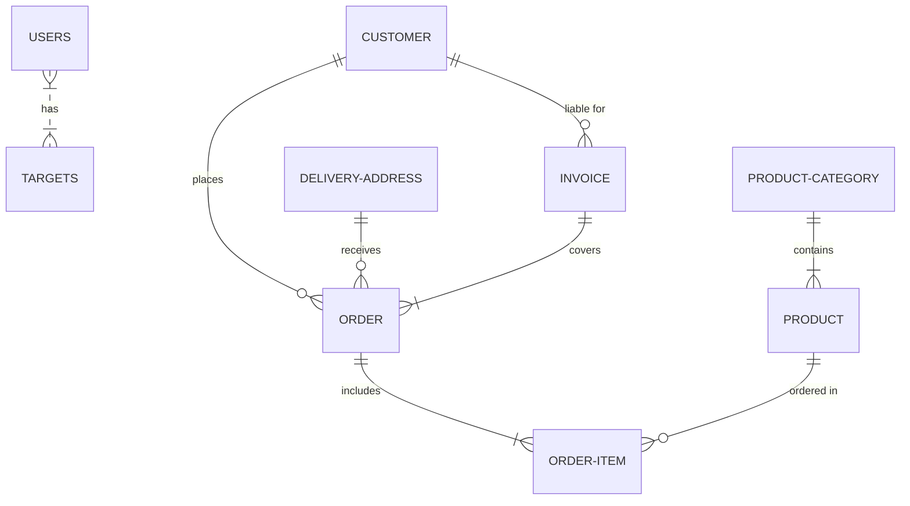

Repositório responsável pela relação de tabelas

```mermaid
    erDiagram
    USERS }|..|{ TARGETS : has
    CUSTOMER ||--o{ ORDER : places
    CUSTOMER ||--o{ INVOICE : "liable for"
    DELIVERY-ADDRESS ||--o{ ORDER : receives
    INVOICE ||--|{ ORDER : covers
    ORDER ||--|{ ORDER-ITEM : includes
    PRODUCT-CATEGORY ||--|{ PRODUCT : contains
    PRODUCT ||--o{ ORDER-ITEM : "ordered in"
```
<<<<<<< HEAD

=======
>>>>>>> 560a2096ad04928d651513eed49d8a2fba9380f5
