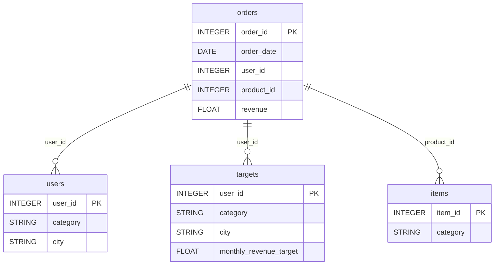
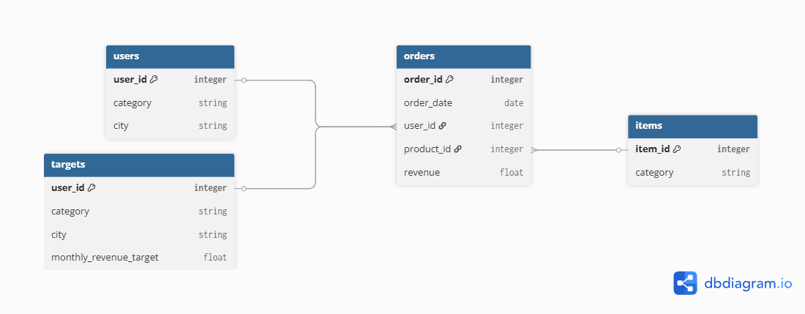

Repositório responsável pela relação de tabelas

```mermaid
    erDiagram
    items {
        INTEGER item_id PK
        STRING category
    }

    orders {
        INTEGER order_id PK
        DATE order_date
        INTEGER user_id
        INTEGER product_id
        FLOAT revenue
    }

    targets {
        INTEGER user_id PK
        STRING category
        STRING city
        FLOAT monthly_revenue_target
    }

    users {
        INTEGER user_id PK
        STRING category
        STRING city
    }

    orders ||--o{ users : "user_id"
    orders ||--o{ targets : "user_id"
    orders ||--o{ items : "product_id"
```

